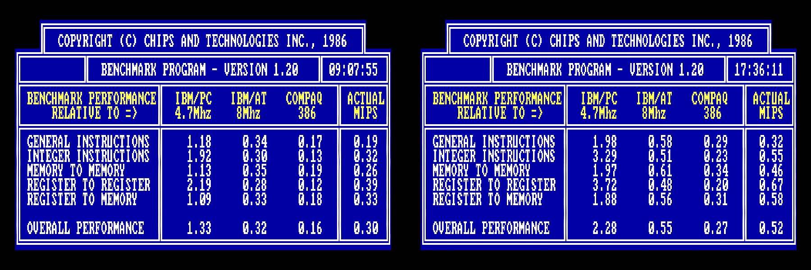
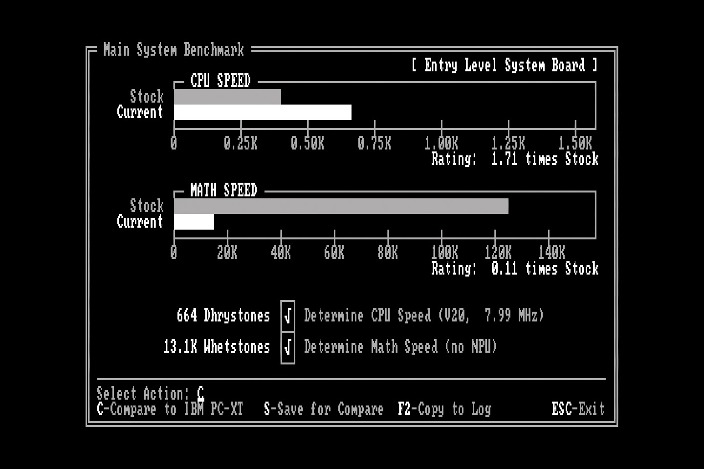
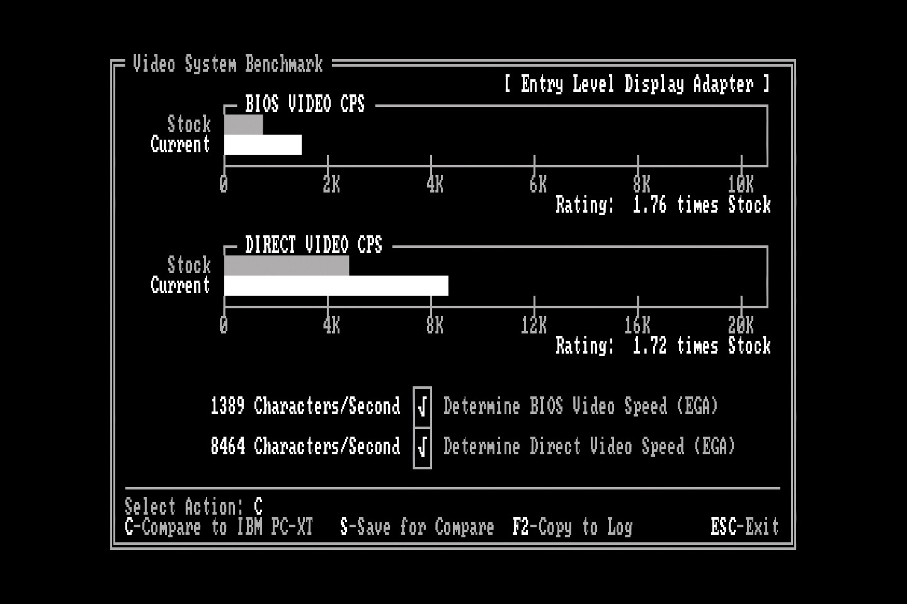
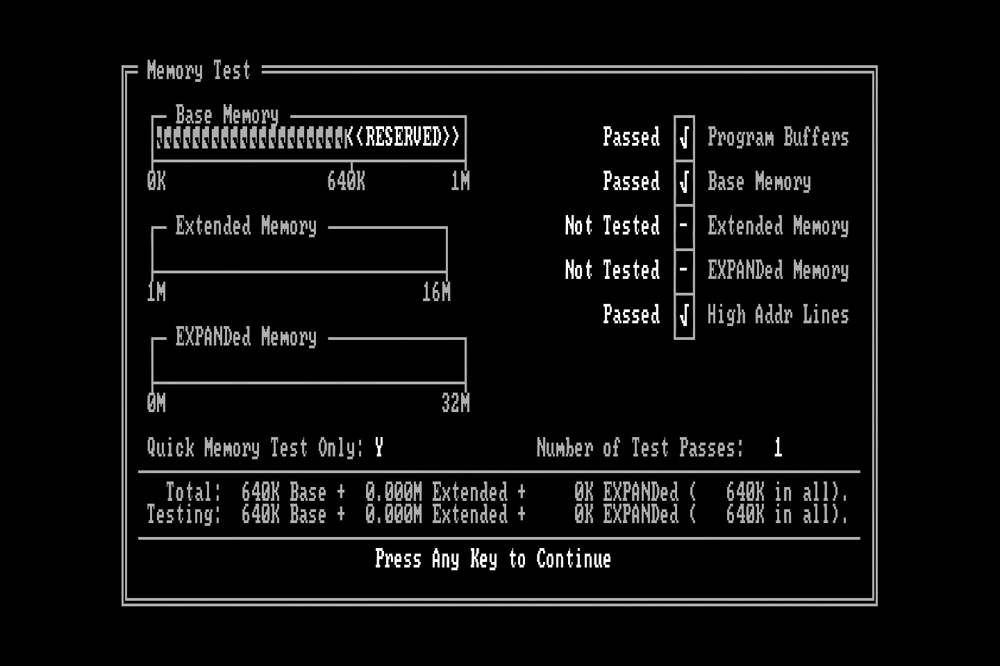

# PC-SPRINT v2

Building on the work of Doug Severson from 1985, the PC-SPRINT v2 is an updated and improved DIY Open Hardware overclocking device for 8088-based systems. Please see the [PC-SPRINT README](/README.md) for an introduction to the original device.

With the potential for DMA-related problems I decided that it would be worth attempting to improve the design of the PC-SPRINT. Although I haven't run into these problems myself at the recommended clock speed of 7.37MHz it will be a fun project and an opportunity to teach myself some things about KiCAD, PCB fabrication and early PCs. With all that in mind, the PC-SPRINT v2 will aim to seamlessly switch back to the stock clock speed whenever there is DMA activity, hopefully eliminating the possibility of lockups.

To understand why and how, we'll start with a quick history lesson.

In 2014 fellow VCFed forum user [Sergey Kiselev](https://github.com/skiselev), author of various high profile 8088 and Z80 hardware projects, analysed the PC-SPRINT and [observed](http://www.vcfed.org/forum/showthread.php?41940-IBM-XT-cpu-upgrade&p=319044#post319044) that it didn't disable the turbo mode when the system was performing DMA activity, as per other "turbo" PC clones. [DMA or "Direct Memory Access"](https://en.wikipedia.org/wiki/Direct_memory_access) is a way for devices to read and write directly to RAM, bypassing the CPU. If the device in question isn't designed to take account of the CPU running at a different clock speed to the rest of the system this can result in potential problems. Based on this, Sergey went on to design and release his own solution, the [Turbo 8088](../References/Turbo%208088%20-%20Schematic.pdf), based on his [Xi 8088](http://www.malinov.com/Home/sergeys-projects/xi-8088) ISA processor board.

In 2019, yet another VCFed forum user, inmbolmie, [decided to build one](http://www.vcfed.org/forum/showthread.php?70923-IBM-5160-overclock-Sergey%92s-way), as well as fixing some bugs in Sergey's design. The updated version was dubbed the [Turbo8088 v2](../References/turbo8088%20v2.pdf). The board was successfully tested in a 5160 at up to 25MHz giving an impressive 8.33MHz CPU clock. Over this speed various problems were reported.

As you can see, the Turbo8088 is a large design that adds a lot of components and complexity. I don't want to tread on Sergey's toes as he's one of the best when it comes to systems architecture and electronics but I decided to see whether it would be possible to incorporate the DMA signals Sergey identified into the PC-SPRINT, making for a simple and compact hybrid solution.

I believe that I have succeeded in this, and my PC-SPRINT v2 prototypes are currently being tested.

As this started life as a freely available project it only seemed right to release the PC-SPRINT v2 under the GPL. The package includes the KiCAD and gerber files for PCB fabrication. This is an ongoing project and this repo will be regularly updated as new information comes to light from ongoing research and testing.

~~The PC-SPRINT v2 files are available [here](KiCAD).~~
I came up against some problems during some testing that will require a minor redesign. I have decided to make the v2 files unavailable until I at least have a working prototype. For now, if you want a PC-SPRINT, I highly recommend you go build [the original version](../). They're great!

## DMA Signals on the 5150 Motherboard

After confirming using the [IBM Technical Reference](../References/IBM_5150_Technical_Reference_6322507_APR84.pdf), I believe that we can pick these up from what are essentially the same locations as Sergey's design for the 5160. The Turbo8088 and indeed the PC-SPRINT v2 would then be able to incorporate the following:

- HRQDMA: From pin 10 of the Intel 8237 DMA controller IC. This pin goes HIGH on DMA activity. This part is labelled U35 on the 5150 motherboard. If an AMD part is used (as in my case) it will be have the part number Am9517A.
- HRQWAIT: From pin 7 of an 74LS175 IC. As above, this pin also goes HIGH on DMA activity. This part is labelled U98 on the 5150 motherboard - note that it is inaccessible with the motherboard in place due to the floppy drive bays.

The above picture is taken courtesy of inmbolmie's 5160 installation for the Turbo8088, however these are essentially identical for the 5150. I will update with my own picture when I get a chance to get one.

On the PC-SPRINT v2, these inputs are connected to a new NOR gate along with the turbo button.This should give us the required logic to switch to the lower clock speed if either of these inputs go HIGH. Of course this reverses the function of the turbo button, but it's no big deal (most turbo buttons "back in the day" worked this way anyway).

## Current Status

Here are the specs of my IBM 5150 as tested:

|Part|Model|Notes|
|---|---|---|
|CPU|[NEC V20 / D70108C-10](https://en.wikipedia.org/wiki/NEC_V20)|Rated up to 10MHz. 4.77MHz stock / 8MHz "turbo" with PC-SPRINT v2.|
|FPU|[Intel 8087-1](https://en.wikipedia.org/wiki/Intel_8087)|8087 co-processor rated up to 10MHz.|
|RAM|640KB (150ns)|(256KB onboard, 384KB on SixPakPlus card)*|
|Motherboard|64-256KB [Later Revision](http://www.minuszerodegrees.net/5150/motherboard/5150_motherboard_revisions.htm)|[10/27/82 BIOS](http://minuszerodegrees.net/5150/bios/5150_bios_revisions.htm)|
|HDD|XT-IDE with 512MB CompactFlash card|Running [IDE_XTP.BIN BIOS](https://www.lo-tech.co.uk/wiki/XTIDE_Universal_BIOS)|
|Graphics|IBM EGA||
|Network|3com EtherLink II||
|Floppy|2x Tandon 360KB 5.25"|Stock IBM Floppy ISA interface|
|PSU|Standard 110VAC / 63.5W|
|Operating System|[IBM PC DOS 2000](https://winworldpc.com/product/pc-dos/2000)||

\* All RAM chips were recently replaced with "New Old Stock" [Samsung KM4164B-15](http://www.minuszerodegrees.net/memory/4164.htm) parts, which have a 150ns access time.

The PCBs have arrived from [PCBWay](https://www.pcbway.com/) and the v2 is currently undergoing testing. The new design is around 20mm longer than the original, meaning that it now extends underneath the left hand floppy / hard drive (if fitted). Thankfully there is plenty of clearance, however it is recommended that the board is assembled with 90 degree pin headers on J1 and J2 (as pictured below) as there is minimal space for the cables to protrude upwards. The PCB design may be modified in future but this is not a current priority.

**The PC-SPRINT v2 is working as intended but without the J2 DMA pins connected. This means that it is permanently in turbo mode and may cause problems with DMA transfers.**

The next step will be to get these connected up and tested. For now, based on my experience, the PC-SPRINT (v1 or v2) with a 22.11MHz crystal is a perfectly safe and worthwhile upgrade - at least with my system as documented above.

## Timing Crystal Values Tested

These are the values I have tested in my system so far. Your results may differ.

|Crystal Value|CPU Clock Speed|Result|Notes|
|---|---|---|---|
|21.4772MHz|7.16MHz|Working|Same clock speed as [Tandy 1000 EX and HX](https://en.wikipedia.org/wiki/Tandy_1000#Tandy_1000_EX_and_HX).|
|22.1184MHz|7.37MHz|Working|This is the original PC-SPRINT recommended value.|
|24MHz|8MHz|System will not boot / lockups when enabled*|Same clock speed as later [IBM PC/AT](https://en.wikipedia.org/wiki/IBM_Personal_Computer/AT).|

\* I was initially testing with a D70108C-5, which is the 5MHz version of the NEC V20. When swapping to a D70108C-10, the system will at least allow me to run some benchmarks, however it is very unstable when loading applications. It even more unstable with the 8087-2 FPU installed. This is the 8MHz part, however I have a 10MHz-capable 8087-1 on its way to me for further testing. I'm hoping that [hooking up the DMA signals](#dma-ignals-on-the-5150-motherboard) will alleviate these issues.

For more information on timing please see the [original PC-SPRINT documentation](/blob/master/README.md) for now.

## Benchmarks

Here are some screenshots taken with the PC-SPRINT running at 8MHz. This is a work in progress. For much more comprehensive benchmarks at a more sensible (working) speed please see the [PC-SPRINT README](/README.md).

### MIPS

Chips & Technologies MIPS was written by Jim Bracking and released in 1986. It's a very comprehensive test covering various number-crunching operations, and even shows your score compared to typical examples of machines of that era - an IBM PC, PC/AT and a Compaq 386.

Turbo disabled on the left, enabled on the right.

|Benchmark|V20 Stock|V20 Turbo|Improvement|
|---|---|---|---|
|General Instructions|0.19|0.32|68.42%|
|Integer Instructions|0.32|0.55|71.88%|
|Memory To Memory|0.26|0.46|76.92%|
|Register To Register|0.39|0.67|71.79%|
|Register To Memory|0.33|0.58|75.76%|
|Overall Performance|0.30|0.52|73.33%|

MIPS also shows that our overclocked NEC V20 is over twice as fast as a stock IBM 5150 running an Intel 8088 CPU.

### CheckIt

From [WinWorldPC](https://winworldpc.com/product/checkit/30), who said it better than I ever could:

CheckIt, from TouchStone Software Corporation, is a diagnostic tool for generic PC/XT/AT compatible computers. It can perform tests on RAM, hard disks, video cards, floppy disks, motherboard resources, and I/O devices. It has an easy to use menu interface but can also run tests non-interactively.

I'm running version 3, the last release from 1990. In each of these screenshots the "Stock" value (top grey line) is the NEC V20 measured with turbo mode off.

|Benchmark|V20 Stock|V20 Turbo|Improvement|
|---|---|---|---|
|CPU [Dhrystones](https://en.wikipedia.org/wiki/Dhrystone)|387|664|71.58%|
|FPU [Whetstones](https://en.wikipedia.org/wiki/Whetstone_(benchmark))*|123.1K|13.1K|-89.36%|

\* Note that the 8087-2 is incredibly unstable at this clock speed so I had to remove it for this test, hence the huge decrease in performance on this test. Realistically, [not much uses the 8087](https://ctrl-alt-rees.com/2019-06-06-list-of-software-that-utilizes-intel-8087-math-coprocessor-fpu.html), but I have a faster one on order anyway.

|Benchmark|V20 Stock|V20 Turbo|Improvement|
|---|---|---|---|
|Transfer Speed|198.9K/sec|342.5K/sec|72.2%|
|Average Seek Time*|1.7ms|1ms|70%|
|Track Seek Time*|1.7ms|1ms|70%|

\* Note that when it comes to seek times, lower numbers are better.

|Benchmark|V20 Stock|V20 Turbo|Improvement|
|---|---|---|---|
|BIOS Video Speed|788chr/sec|1389chr/sec|76.27%|
|Direct Video Speed|4930chr/sec|8464chr/sec|71.68%|

I also ran various RAM tests with turbo enabled to see if it would pick up any errors, but, perhaps surprisingly, all tests actually passed with no problems.

### Benchmarking Conclusions

As it stands, without the DMA side of things hooked up, I can highly recommend *against* the 24MHz crystal. However the benchmarks are pretty tantalising and show that this is definitely worth pursuing further - a 70% increase in performance is certainly better than a 50-55% increase [as originally measured](/README.md), after all!

## License

The original  design was released under a license similar to the modern-day GPL (IANAL), so I have attached that license here. The PC-SPRINT v2 is therefore assumed to comply with the [Open Hardware Specification](https://en.wikipedia.org/wiki/Open-source_hardware).